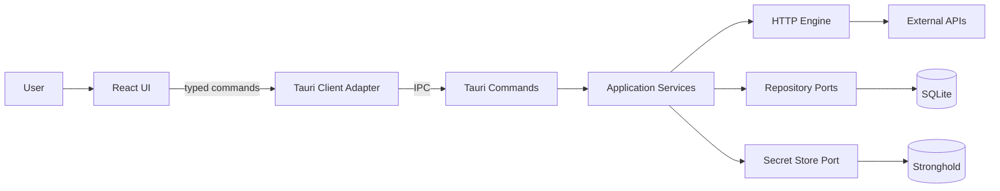
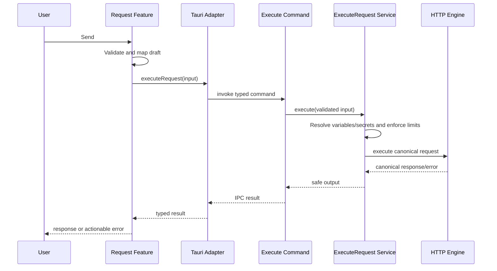

# Laika Architecture Guidelines

This document is the primary guide for designing and developing Laika with a structure that is easy to understand, test, extend, and maintain over the long term. It reflects the context of a local-first desktop application that uses React + TypeScript for the UI and Tauri + Rust for native capabilities.

> Status: Target architecture — the current codebase may not yet implement this entire structure. Adopt it incrementally while building each vertical slice; do not move every file in advance.

## 1. Architecture Goals

The design priorities are:

1. **Correctness and security** — Send HTTP requests correctly, prevent secret leakage, and handle data safely.
2. **Clear boundaries** — Keep the UI, business rules, native transport, and persistence from being directly coupled.
3. **Feature locality** — Keep code for the same feature close together so it is easy to find, change, and remove.
4. **Testability** — Business logic must be testable without launching the UI, Tauri runtime, or a real database.
5. **Replaceability** — State libraries, databases, HTTP clients, and editors should be replaceable without affecting the entire system.
6. **Pragmatism** — Create abstractions when a real boundary or reuse case exists. Avoid layers that only pass values through without adding value.

## 2. System Context



There are three primary boundaries:

- **Frontend** accepts input, presents output, and manages interaction state.
- **Rust application core** controls use cases and business rules.
- **Infrastructure** communicates with the network, database, secret storage, and operating system.

React must never access SQLite, Stronghold, or the HTTP engine directly. Every native operation must pass through a typed Tauri adapter and a clearly scoped command.

## 3. Dependency Rule

Dependencies must always point toward more stable logic:

```text
UI -> Feature application logic -> Frontend contracts
                         |
                         v
                  Tauri client adapter
                         |
                         v IPC
Tauri commands -> Rust application services -> Domain
                            |
                            v
                    Infrastructure ports
                            |
                            v
              HTTP / SQLite / Stronghold / OS
```

Mandatory rules:

- `components/ui` must not import from `features`, `store`, or the Tauri API.
- A feature must not directly import another feature's internal files. Use the public API from `features/<name>/index.ts`.
- React components must not call `invoke` from `@tauri-apps/api` directly.
- Tauri commands must remain thin: deserialize, perform initial validation, call a use case, and map the result.
- Rust domain and application services must not depend on Tauri, SQLite, or `reqwest`.
- Infrastructure implements interfaces/traits defined by the application core.
- Circular dependencies are prohibited between both modules and features.

## 4. Recommended Project Structure

This is the target structure as the features mature. Do not create empty directories in advance.

```text
.
├── docs/
│   ├── architecture.md
│   ├── plan.md
│   └── adr/                         Architecture Decision Records
├── src/
│   ├── app/                         Composition root and app-wide setup
│   │   ├── app.tsx
│   │   ├── providers.tsx
│   │   └── routes.tsx               Add only when routing is needed
│   ├── components/
│   │   ├── ui/                      Generic design-system primitives
│   │   └── layout/                  App-wide layout components
│   ├── features/
│   │   ├── request/
│   │   │   ├── api/                 Feature-specific native calls
│   │   │   ├── components/
│   │   │   ├── hooks/
│   │   │   ├── model/               Types, schemas, pure transformations
│   │   │   ├── store/               Feature state when needed
│   │   │   ├── tests/
│   │   │   └── index.ts             Public feature API
│   │   ├── response/
│   │   ├── collections/
│   │   ├── history/
│   │   └── environments/
│   ├── shared/
│   │   ├── api/                     Tauri client, IPC envelope, shared DTOs
│   │   ├── config/                  Limits and runtime configuration
│   │   ├── lib/                     Pure generic utilities
│   │   └── types/                   Types genuinely shared across features
│   ├── styles/
│   └── main.tsx
└── src-tauri/
    ├── migrations/                  Versioned SQLite migrations
    └── src/
        ├── lib.rs                   Composition root and plugin setup
        ├── commands/                Tauri IPC entry points
        ├── application/             Use cases and ports
        │   ├── request/
        │   ├── collection/
        │   ├── history/
        │   └── environment/
        ├── domain/                  Entities, value objects, domain errors
        ├── infrastructure/
        │   ├── http/                reqwest implementation
        │   ├── persistence/         SQLite repositories
        │   └── secrets/             Stronghold implementation
        ├── dto/                      IPC request/response structures
        ├── error.rs                  Internal error taxonomy and safe mapping
        └── state.rs                  Managed application state
```

### File Placement Criteria

- Use **feature-first** organization for code that delivers user-facing capabilities, such as requests, history, and environments.
- Use **layer-first organization inside the Rust core** to preserve dependency inversion between domain, application, and infrastructure.
- Place code in `shared` only when at least two features use it and there is no clearer domain owner.
- Shared code that still has a clear owner remains in the owning feature and is exported through `index.ts`.
- Do not create large `helpers.ts`, `utils.ts`, or `common.ts` files that mix unrelated logic.

## 5. Frontend Architecture

### 5.1 Component Responsibilities

Separate components by role:

- **Page/Layout** composes features and defines layout.
- **Feature component** presents a feature-specific workflow and connects to its hooks/store.
- **UI primitive** is generic, contains no business rules, and knows nothing about application state.

Components should receive data through props and emit events. When data transformation, validation, or asynchronous orchestration grows substantial, move it into the feature's hook, model, or service.

### 5.2 State Ownership

Use the narrowest state scope that satisfies the requirement:

| Data type | Recommended owner | Example |
| --- | --- | --- |
| Temporary component UI | React local state | Dialog visibility, hover state, temporary draft input |
| Shared within one feature | Feature hook/store | Request draft, active request tab |
| Shared across features | App store divided into slices | Active workspace, active environment, theme |
| Data from Rust/SQLite | Query/cache layer or feature store | Collections, history |
| Secret | Stronghold; frontend holds only a reference or masked value | Bearer token reference |

Zustand rules:

- Split stores by domain/feature as state grows; do not put everything in one global store.
- Selectors must select only the values a component uses to reduce unnecessary renders.
- Store actions perform synchronous state transitions; asynchronous workflows belong in feature services/hooks.
- Compute derived state from its source of truth instead of storing multiple copies.
- Persisted data must come from Rust repositories; do not use browser storage as the primary database.

### 5.3 Data Transformation

Separate models by purpose:

- **View model** supports editing and presentation, such as rows with `id` and `enabled` fields.
- **Command DTO** is a validated payload ready to cross the IPC boundary.
- **Domain/persistence model** is the canonical representation on the Rust side.

Never send the entire Zustand state object to Tauri. Map only the fields required by the command using a testable pure function.

```ts
export function toExecuteRequestInput(draft: RequestDraft): ExecuteRequestInput {
  return {
    method: draft.method,
    url: draft.url.trim(),
    headers: enabledEntries(draft.headers),
    body: toRequestBody(draft),
  };
}
```

### 5.4 Public Feature API

Each feature's `index.ts` exports only what other features are allowed to use, such as its primary component, public types, or intentionally exposed hooks. Do not export every internal component for convenience.

## 6. Rust Backend Architecture

### 6.1 Layers

**Commands**

- Act only as IPC adapters.
- Accept DTOs, call application services, and return DTOs or safe errors.
- Must not contain SQL, create a `reqwest::Client`, or implement complex business logic.

**Application**

- Define one use case per intent, such as `ExecuteRequest`, `SaveRequest`, or `ListHistory`.
- Coordinate workflows, transactions, and policies.
- Declare the ports/traits required from infrastructure.

**Domain**

- Hold invariants and core types such as validated URLs, HTTP methods, and secret references.
- Remain framework-independent and support serialization only when justified by the domain.

**Infrastructure**

- Implement application ports using `reqwest`, SQLite, and Stronghold.
- Convert library errors into the internal error taxonomy before returning them to an upper layer.

### 6.2 Shared Application State

Create expensive resources—such as the HTTP client, database pool, and service registry—once in `lib.rs`, then place them in Tauri managed state. Never recreate them for every command.

State shared across threads must have explicit ownership and synchronization. Avoid global mutable state, and never hold a lock during network I/O.

### 6.3 Async and Cancellation

- Network and database I/O must be asynchronous or isolated from the UI thread.
- Every request has a correlation/request ID.
- Cancellation uses a cancellation token mapped by request ID and always cleans it up after completion.
- Define timeout and response-size limits in configuration rather than scattering values across files.
- Retryable operations must have explicit conditions and attempt limits. Never automatically retry non-idempotent requests.

## 7. Frontend–Backend Contract

IPC is a public boundary within the application and must be treated like an API:

- Name DTOs by intent, such as `ExecuteRequestInput` and `ExecuteRequestOutput`.
- Mark every field as required or optional explicitly, and include units in names such as `timeoutMs` and `sizeBytes`.
- Use tagged unions/enums instead of multiple booleans that can conflict.
- Validate on the frontend for UX and on the backend because it is a trust boundary.
- Command names and DTO changes that affect compatibility require a migration plan.
- Add contract tests or a generation strategy for TypeScript/Rust contracts as the contract grows.

Recommended result shape:

```ts
type CommandResult<T> =
  | { ok: true; data: T }
  | { ok: false; error: ApplicationError };

interface ApplicationError {
  code: string;
  message: string;
  recoverable: boolean;
  details?: Record<string, string>; // Must already be redacted
}
```

Never return stack traces, raw library errors, SQL, local paths, or secrets to the frontend in production.

## 8. Request Execution Flow



The source of truth for the request actually sent should be the canonical request produced by the application service after resolving variables and secrets. Resolved values must never be written directly to history or logs.

## 9. Persistence and Data Ownership

- SQLite is the source of truth for workspaces, collections, saved requests, and history.
- Stronghold is the source of truth for secret values.
- SQLite may store only opaque secret references, never plaintext secrets.
- React state is a working copy/cache, not a durable source of truth.
- Every schema change must have an ordered migration. Never modify a migration that has already been released.
- Operations that change multiple entities must use a transaction.
- Repositories return domain models rather than exposing raw database rows to commands or the UI.
- Broad delete operations must define cascade/restrict behavior explicitly and include tests.
- Define retention, size limits, and cleanup policies for history and response bodies.

Test migrations in at least two scenarios: a new database and an upgrade from the previous version. Important data should have a backup/recovery strategy before risky schema changes.

## 10. Security and Privacy

The primary principle is to expose secrets as little and as briefly as possible:

- Store sensitive tokens, passwords, API keys, and cookies in Stronghold.
- Redact values in `Authorization`, `Proxy-Authorization`, `Cookie`, `Set-Cookie`, and any header the user marks as secret.
- Logs and analytics must not include request or response bodies by default.
- Display secrets as masked values; revealing or copying them must require an explicit action.
- Clear secrets from the clipboard when supported by the platform and governed by a predictable policy.
- Validate URL schemes and define policies for local/file/private-network access before adding redirects or import automation.
- Apply least privilege to Tauri capabilities and enable only required commands/plugins.
- Evaluate maintenance, license, security, and bundle impact before adding a dependency.
- User-facing error messages must be actionable without exposing credentials or unnecessary internal details.

## 11. Error Handling and Observability

Use stable error categories such as:

- `validation` — Invalid input that the user can correct.
- `network` — DNS, connection, TLS, and offline failures.
- `timeout` / `cancelled`.
- `storage` — Database availability, migration, or corruption failures.
- `secret_store` — Locked storage, a missing reference, or an access failure.
- `internal` — Unexpected invariant or system failures.

Every error that crosses IPC must have a stable code and safe message. Keep technical details in a redacted local diagnostic log.

Use a correlation ID to connect UI operations, commands, and backend logs without logging sensitive payloads. Useful metrics include duration, status class, response size, and error code; telemetry that leaves the device must be opt-in.

## 12. Testing Strategy

Use a test pyramid focused on logic and boundaries:

| Level | Purpose | Examples |
| --- | --- | --- |
| Unit | Pure logic and invariants | Draft mapping, variable resolution, redaction, URL validation |
| Component | UI behavior | Editing parameters, loading/error states, keyboard workflows |
| Contract | Types and serialization across IPC | DTO field names, enum variants, error envelope |
| Integration | Real infrastructure in a controlled environment | reqwest + local mock server, repository + temporary SQLite |
| End-to-end | Critical user journeys | Compose -> send -> inspect -> save -> reopen |

Testing rules:

- Test behavior, not implementation details.
- Network tests use a local mock server rather than a public API.
- Database tests use isolated temporary databases and apply real migrations.
- Every bug fix should include a regression test at the smallest level that detects the issue.
- Do not use large snapshots in place of meaningful assertions.
- Maintain secret-redaction and response-size-limit tests as a security regression suite.

Minimum quality gates before merge:

```bash
pnpm build
cargo fmt --manifest-path src-tauri/Cargo.toml --check
cargo clippy --manifest-path src-tauri/Cargo.toml --all-targets -- -D warnings
cargo test --manifest-path src-tauri/Cargo.toml
```

When a frontend test runner is added, include unit/component tests and linting in the CI gate.

## 13. Code Conventions

### TypeScript / React

- Use TypeScript strict mode and avoid `any`; begin with `unknown` and validate when data is not yet trusted.
- Use `kebab-case` for files/directories, `PascalCase` for components/types, and `camelCase` for functions/variables.
- Prefix custom hooks with `use`.
- Prefer named exports for reusable modules; use default exports only for entry points where the framework makes them appropriate.
- Avoid side effects during rendering and keep side effects at boundaries.
- UI text and accessibility labels must be clear; primary interactions must support keyboard use.
- Prefer design tokens over hard-coded colors, and centralize variants in UI primitives.

### Rust

- Use `snake_case` for modules/files/functions and `PascalCase` for types/traits.
- Use domain-specific newtypes when a primitive has invariants or could easily be confused with another value.
- Avoid `unwrap()`/`expect()` in production paths unless an invariant is proven and documented with a clear message.
- Add context when errors cross layers, but redact them before logging or sending them across IPC.
- Functions and modules should have one responsibility; keep public APIs as small as possible.
- Format with `rustfmt` and resolve all Clippy warnings before merge.

### General

- Name code by intent rather than implementation: `execute_request` is better than `call_reqwest`.
- Comments explain why something exists or document a constraint; they should not repeat what the code already says.
- Put magic numbers and limits in named configuration.
- Dependency direction matters more than reducing line count or avoiding one additional file.

## 14. Adding a New Feature

Develop each feature as a vertical slice in this order:

1. Define the user outcome, data owner, security concerns, and failure modes.
2. Define the required domain terms and the smallest necessary IPC contract.
3. Create pure models/validation with unit tests.
4. Create the application use case and required ports.
5. Implement infrastructure adapters and integration tests.
6. Add the Tauri command and typed frontend adapter.
7. Build the feature UI with loading, empty, success, and error states.
8. Run an end-to-end smoke test and update documentation.

Feature Definition of Done:

- No dependency rule is violated.
- The happy path and important failures have tests.
- Cancellation, timeout, and loading behavior are handled when relevant.
- Sensitive data is classified and redacted.
- Accessibility and keyboard workflows pass review.
- Build, formatting, linting, and tests pass.
- Contracts, migrations, and documentation are updated when affected.

## 15. Architecture Decision Records

Create `docs/adr/NNNN-short-title.md` for decisions that change a boundary, data ownership, the security model, or a major dependency. Use this format:

```md
# NNNN: Decision title

## Status
Proposed | Accepted | Superseded

## Context
The problem, constraints, and driving forces

## Decision
The chosen approach and its scope

## Consequences
Benefits, drawbacks, risks, and follow-up work
```

Examples of decisions that warrant an ADR include SQLite integration, secret storage, IPC contract generation, the cancellation model, response-body storage, and the scripting sandbox.

## 16. Anti-patterns to Avoid

- A global store that combines server data, form state, dialogs, and business workflows.
- A component that calls Tauri, maps DTOs, validates data, and renders the UI in one file.
- A Tauri command containing all SQL, networking, and business logic.
- Cross-feature imports through internal paths such as `features/history/components/internal-row`.
- One model used as the database row, IPC DTO, and editable form state in every context.
- Catching errors and returning strings that cannot be classified.
- Logging complete request headers or bodies for debugging.
- Generic abstractions with one implementation and no clear boundary.
- A `shared` directory that becomes a dumping ground for code with no obvious location.
- Migration or contract-breaking changes without a compatibility/recovery plan.

## 17. Incremental Adoption for the Current Codebase

Adopt this structure when Phase 2 begins, in the following risk-reducing order:

1. Separate the current HTTP contracts into request feature models and shared IPC DTOs according to ownership.
2. Create `shared/api/tauri-client.ts` so components cannot call `invoke` directly.
3. Move request actions out of the app-wide Zustand store into a request feature store.
4. Create Rust `commands`, `application`, `domain`, and `infrastructure/http` modules while implementing the REST Request MVP.
5. Add repository ports and migrations when SQLite work begins; do not create persistence abstractions before a use case exists.
6. Add the Stronghold adapter and secret references when environment/secret work begins.

Every step must keep the production build passing. Move only the code paths currently under development to avoid large refactors that are difficult to review.

---

This document is a living guideline. If an implementation must diverge from a core rule, record the reason in an ADR and update this document after the new approach is accepted.
